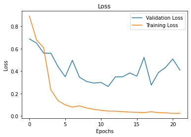
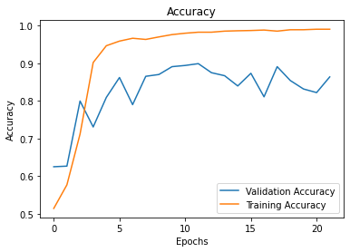
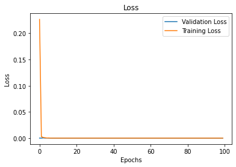
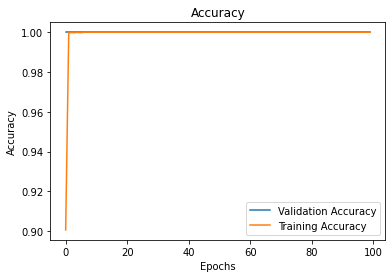
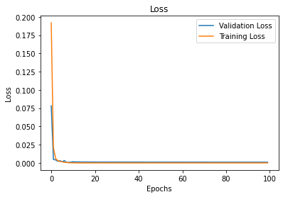
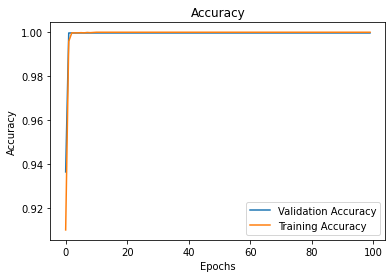

# X-Ray Colorization & Neural Networks

**Techinal Blog:** https://medium.com/analytics-vidhya/treating-overfitting-in-cnns-1f68c57f57b2

**EDA Blog:** https://medium.com/@gabriel.erica3/x-ray-colorization-and-neural-networks-2cdc578a1d2f?source=friends_link&sk=0479c0ef9b3ab7f817560bf4ef63153f

**Non Technical Presentation:** https://youtu.be/c1hmxA5Ed90

## Purpose
At times, the evidence of pneumonia may be in a portion of the lung that is not easily seen by the standard x-ray. The misdiagnosis of pneumonia delays treatment and can results in long term disability or death. This study aims to prove that if X-ray images are colorized, the rate of misdiagnosis (and complications associated) will decrease. This project is an expansion of Deep Learning & Pneumonia Detection https://github.com/EricaSG/Mod4Project

## Background and Description of Data
The x-rays were provided by the Guangzhou Women and Children’s Medical Center in Guangzhou, China, on patients ranging from ages 1–5 years old.The image set contains images of “Normal”, “Viral” & “Bacterial” Pneumonia, classified into 2categories: “Normal”and “Pneumonia”. There were initially 1341 Normal scans and 3875 Pneumonia scans. All unreadable and poor 
quality scans were removed prior to providing the dataset. 
Files: 
* Train- The set of images to be used for training
* Val- The set of "holdout" images used to tune and optimize the model(s)
* Test- The set of images used to validate the best performing model
* c_train - The colorized set of images to be used for training
* c_val - The set of "holdout" images used to tune and optimize the model(s)
* c_test - The set of images used to validate the best performing model

## Methodology
To execute this study, I developed an A/B Test where Group A was the control group consisting of unaltered greyscale images. The dataset initially had 1341 Normal scans and 3875 Pneumonia scans. The class imbalance was addressed using a image data generator, and both classes of images were incrested to 7600 images each, and the resolution was initially set to (96 x 96). The final resolution of these images was set to (128 x 128) to improve accuracy and model performance.

In order to create Group B, the experiemntal group,  the control group was duplicated, and then colorized using the library deOldify. These images were sized to (128 x 128) in order to be trained using the "best" model which was created from training the grayscale set.

## Model Performance
### Grayscale Models
The initial models from the Module 4 project were high variance and high bias. with the final traing and testing accuracy being 50% and 35%.  I increased the image sizes from (64 x 64) to (96 x 96) believing that that images from the previous project were too small for the layers of the model to see all of the details. I then increased the number of images from 7750 to 11,200 total. Once these changes were implented the folowing metrics were observed:
* **Training Loss:** 0.005
* **Validation Loss:** 0.322
* **Training Accuracy:** 0.998
* **Validation Accuracy:** 0.875

A number of optimization and regularization techniques were used to reduce the variance in the model such as,
* **L2 Regularization:** He
* **Weight Initiialization**
* **Dropout Regularization**
* **Weight Constraint:** unit_norm, min-max

The best performing models from training on the validation set came from using the weight constraint, *unit_norm* and dropout regularization. The metrics observed for were:
* **Training Loss:** 0.008
* **Validation Loss:** 0.050
* **Training Accuracy:** 0.997
* **Validation Accuracy:** 1.0

The best validation model was trained using the testing data and initially yielded the following results:
* **Training Loss:** 0.001
* **Validation Loss:** 1.73
* **Training Accuracy:** 1.0
* **Validation Accuracy:** 0.756

To treat the high variance and bias of this model, I increased the training set was increassed the size of 
training data from 11,200 to 15,200 images and the image resolution was increased to (128 x 128). The final
and best model was achieved by combining both dropout regularization and the unit_norm weight constraint. The 
results were as follows:
* **Training Loss:** 0.027
* **Validation Loss:** 0.408
* **Training Accuracy:** 0.989
* **Validation Accuracy:** 0.863

### Colorized Models
The initial model for the colorized dataset was trained using the best and latest model from the grayscale notebook. That model had a training accuracy of 99% and a validation accuracy of 50%. The model had an extremely high bias and variance. The training accuracy also reached 99 before the first epoch was complete. I reduced the complexity of the model manually by decreasing the amount of layers from six to three, and decreased the amount of filters in each layer by half. After updated the model the validation accuracy increased to 68%. Finally instead of fine tuning the model, I reeamined my data. Though, it is highly reccomended to never tamper with the test and validation sets, the dataset provided by Kaggle was poorly split. The validation dataset consisted of 16 images while the test set held 624 images. The grayscale models were complex enough to handle the imbalance, however now it was time to generate better splits. 

<pre>
    <code>
Xtrain, Xval, ytrain, yval = train_test_split(train_images, train_labels_final, train_size=0.9, test_size=0.1, random_state=42)
Xtrain, Xtest, ytrain, ytest = train_test_split(Xtrain, ytrain, train_size=0.78, random_state=42)
    </code>
</pre>

This resulted in a train/val/test split of 70/10/20%. Then the model was trained with the *new* validation set. The results were as follows:
* **Training Loss:** 3.88e-08
* **Validation Loss:** 2.076e-08
* **Training Accuracy:** 1.0
* **Validation Accuracy:** 1.0

This model was used on the test set which produced the following metrics:
 * **Training Loss:** 1.49e-07
* **Validation Loss:** 0.000985
* **Training Accuracy:** 1.0
* **Validation Accuracy:** 0.999

## Conclusion
The graysclae dataset was more computationally expensive to build and train. The models took an average of 30 minutes to an hour to run, doing only 22 epochs. The grayscale models caused me to use nearly all of my local and google drive storage. The colorized models ran for 100 epochs and took approximately 1 minute to run. The dataset overall did not require much tuning/or massaging 
compared to the grayscale dataset. Validation Accuracy of the colorized model was 99.9%, about 13% higher than the grayscale set. Therefore if computer vision is going to be considered in detection and early diagnosis of pneumonia and similar illnesses, then research funding should be set aside to fund hardware and software developments that produce colorized and perhaps even 3D image scans.
